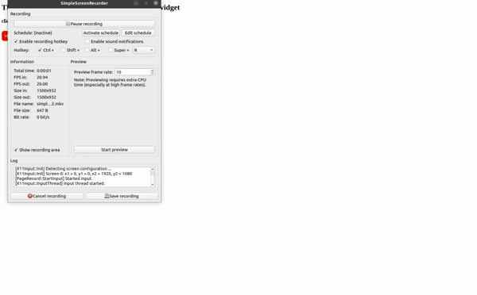

# @mohsen007/react-goftino

> A component simplifies Goftino widget usage in your React application

[]()

## Introduction

This component applies to Goftino Web Widget including contact form, live chat, talk, answer bot and help center. For more information on widget and API, please check [Goftino official documentation](https://www.goftino.com/docs)

## Installation

#### with npm

```sh
npm i @mohsen007/react-goftino
```

#### with yarn

```sh
yarn add @mohsen007/react-goftino
```

## Events

### `onReady`

#### This event will run if the chat widget is ready to use.

### `onSendMessage`

#### If any message is sent by the user, this event will be executed and you will have access to the type and content of the sent message.

### `onGetMessage`

#### If you receive a new message from the operators, this event will run and you will have access to the type and content of the received message.

### `onOpen`

#### This event will be run if the chat widget opens.

### `onClose`

#### This event will be run if the chat widget closes.

## Functions

### `setUser`

##### Using this function, you can send the user information logged in to your website to Goftino to be displayed in the user profile for each conversation and access them.

### `getUser`

##### By sending this request to Goftino, you can receive user information and save and use it on your site if needed.

### `setWidget`

##### By sending this request to Goftino, you can change the appearance of the conversation widget.

###### Note: if you want to hide the widget icon, you need to use the `open` and `close` or `toggle` functions.

### `getUserId`

##### If you need to integrate a user's conversations even with different browsers or devices, first use this function to get the unique user id (id) in Gotino and save it in your site database, then with the help of the function setUserId You can call and apply it when needed.

##### A unique user ID is a 64-letter expression.

### `setUserId`

##### In general, Goftino creates a separate identifier for the user in each browser or device, and performs user authentication based on the browser in which the dialog is displayed. If you have a unique user ID in Goftino and apply this function, your contact can continue their previous conversation with you in any browser or device and prevent a new conversation from being created for that person.

###### Note: after applying the user ID, if you have the previous ID, the new ID will replace it.

### `unsetUserId`

##### If this function is implemented, the current user ID will be removed from the browser and the message history in the conversation will not be displayed in the widget and the page will be reloaded.

###### Note: if the user sends a new message, a new ID will be created for the user.

### `sendMessage`

##### Using this function, you can send the desired message to the user in your desired conditions. This message is for the user only and will not be used in conversations.

### `open`

##### You can use this function to open the chat form.

### `close`

##### You can use this function to close the chat form.

### `toggle`

##### Using this function, the chat form will open if closed and open if closed.

### Note: all above functions are a subset of `Goftino` function and must be used in the `onReady` event.

```js
onReady=() => {
    // Goftino.setUser(...);
    // Goftino.getUser(...);
    // Goftino.setWidget(...);
    // Goftino.getUserId(...);
    // Goftino.setUserId(...);
    // Goftino.sendMessage(...);
    // Goftino.open();
    // Goftino.close();
    // Goftino.toggle();
}}
```

## Component Usage

```js
import React from 'react';
import ReactDOM from 'react-dom';
import { GoftinoSnippet } from '@mohsen007/react-goftino';
const GOFTINO_KEY = 'your goftino embed key';

const App = () => {
  return (
    <GoftinoSnippet
      goftinoKey={GOFTINO_KEY}
      onReady={() => {
        window.Goftino.open();
      }}
    />
  );
};

ReactDOM.render(<App />, document.getElementById('#app'));
```

## Examples

### Your Own Widget



```js
import React from 'react';
import ReactDOM from 'react-dom';
import { GoftinoSnippet } from '@mohsen007/react-goftino';
const GOFTINO_KEY = 'your goftino embed key';

const App = () => {
  const [hideButton, setHideButton] = React.useState(false);

  return (
    <GoftinoSnippet
      goftinoKey={GOFTINO_KEY}
      onReady={() => {
        window.Goftino.setWidget({
            hasIcon: false,
          });
      }}
      onClose={() => {
          setHideButton(false);
        }}
    />
    <button
        onClick={() => {
          window.Goftino.open();
          setHideButton(true);
        }}
        style={{
          opacity: hideButton ? 0 : 1,
          visibility: hideButton ? 'hidden' : 'visible',
          transition: 'all 0.15s linear',
          color: 'white',
          backgroundColor: 'red',
          border: '1px solid yellow',
          borderRadius: 8,
          padding: 8,
          cursor: 'pointer',
        }}
      >
        My Custom Widget
      </button>
  );
};

ReactDOM.render(<App />, document.getElementById('#app'));
```

##### to see full example code [Click Here](https://github.com/moh3n007/react-goftino-snippet/tree/master/example)

## License

#### MIT
